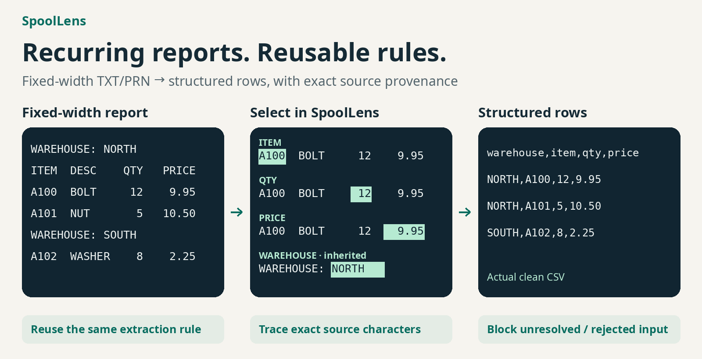
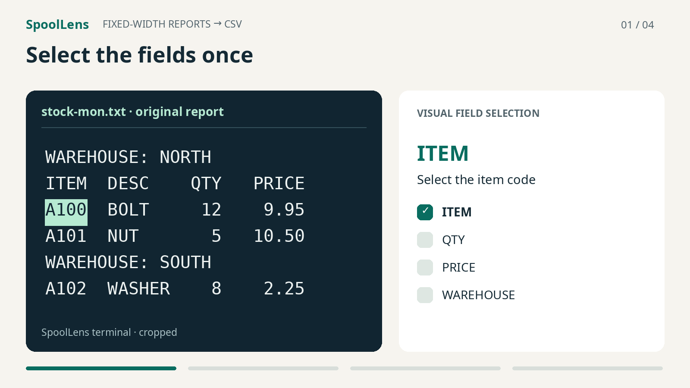

# SpoolLens

Turn recurring fixed-width TXT/PRN reports into traceable CSV with reusable visual rules.



- Select the fields once and reuse the extraction rule
- Trace every value to its exact original source characters
- Block clean export while unresolved or rejected input remains

## 14-second demo



Real terminal captures and actual CSV output, cropped and annotated for readability. [Demo details and the full technical walkthrough](docs/demo/overview/README.md).

## What it is

SpoolLens is a small, keyboard-operated terminal application for recurring fixed-width plain-text TXT/PRN reports. Select character ranges in the original report, preview structured rows, and inspect exact source evidence before exporting.

**v0.1 is deliberately narrow:** one inventory-shaped detail record with `item`, `qty`, and `price`, plus one inherited `warehouse` value. Field positions and widths are user-defined; field names and validators are fixed. Descriptions remain visible in the source but are not exported. This is not a general report parser or a claim of business-data correctness.

## Who it is for

People repeatedly converting the same supported inventory layout into CSV who need to understand where each value came from and which source lines were excluded or rejected. The authoring workflow uses selections and menus, without writing regex, code, or a template language.

## Quick Start

Requires Python 3.10+ with the standard `curses` module, and a Linux or macOS terminal. Linux is tested. Use a terminal at least 100 columns × 30 rows for a comfortable view; smaller terminals can scroll evidence. Native Windows is unsupported; WSL is unverified.

```sh
git clone https://github.com/Haruuuuuuuuu/spoollens.git
cd spoollens
python3 -m venv .venv
. .venv/bin/activate
python -m pip install .
spoollens ui tests/fixtures/A_clean.txt
```

The report opens read-only with an empty rule. Press `?` for help. Follow the [example workflow](#example-workflow) to author your own rule.

For a quick replay of the bundled example instead of authoring:

```sh
mkdir -p output
spoollens replay tests/fixtures/A_clean.txt --rule examples/inventory.rule.json --output output/example.csv
spoollens inspect tests/fixtures/A_clean.txt --rule examples/inventory.rule.json --row 1 --field qty
```

Use a new output filename on subsequent runs. SpoolLens never overwrites existing output files. Keep the adjacent `.audit.json`, `.provenance.json`, and `.manifest.json` files with a clean CSV.

## Example workflow

These instructions apply to any supported layout. Discover positions by reading the report and its column labels; no field coordinates are supplied here.

### 1. Select the detail fields

Move to a complete, well-formed detail row. Arrow keys move the cursor; `Home` / `End` move to the first / last character. Press `Space` at a field's first character and move to its last included character. The highlight and `[start,end)` readout show the exact selection, including spaces. `g` can jump to a line and character you have identified on screen. Line numbers are 1-based; character indices are 0-based. Moving to another line or pressing `Esc` clears the selection.

Select the full padded field, not just the currently visible digits. Use column headings, alignment, and other complete rows to distinguish each field from its separators. Press `f` and choose the corresponding menu slot:

- `item`: one uppercase letter followed by three digits, left-aligned
- `qty`: an unsigned whole number, right-aligned
- `price`: an unsigned decimal with exactly two decimal places, right-aligned

The first field sets the expected detail-line width. Accept the adjacent two-space checks when they match the source layout. These prevent shifted values from being accepted. All three fields and the required two-space separators must be defined. The supported layout has a two-space separator after item, before quantity, and between quantity and price; the last of these is exactly two characters.

Use `r` to review your selections and separator checks. Re-marking a field replaces it; `u` undoes the last change; `s` adds a selected required-space check; `d` removes a component. A draft or incompatible layout cannot clean-export.

### 2. Define inherited context

Find a warehouse header and select its complete padded value. Press `h` and confirm. The text before the selection identifies the header; its selected value is inherited by subsequent detail rows. Warehouse values must be one to eight uppercase letters. A new valid header replaces the value and its provenance; an invalid header clears context.

### 3. Account for headings and footers

On a column heading or footer, clear any selection and press `i` to create an **exact whole-line** ignore. For page headings with changing page numbers, select only the stable beginning of the line, starting at its first character, then press `i` and choose **prefix**. Give each ignore a label of at most 64 characters: start with a lowercase letter, then use lowercase letters, digits, or underscores, for example `page_header`.

Choose **Clear** context at page headings and footers; choose **Keep** at column headings. Press `p` and confirm if the report uses standalone form-feed page breaks. Blank and space-only lines are counted separately and need no ignore rule.

Only ignore text you have actually identified as non-data. An ignore cannot hide a recognized detail or header candidate. Never widen an ignore merely to make a warning disappear.

### 4. Preview and investigate

The lower pane previews candidate rows. Press `v`, choose any output row and field, and inspect the source hash, physical line, character range, and exact source substring. Closing the evidence window returns to the highlighted source. Inherited warehouse values point to the actual header.

Press `n` to cycle through `UNRESOLVED` and `REJECTED` lines. `Enter` shows the current line's complete audit, raw source text, and validation reason. In audit/evidence windows, arrows scroll vertically and horizontally, `Home` / `End` move across long text, and `PgUp` / `PgDn` move through lines. `<` and `>` indicate more text. Press `a` outside a window for full status and file paths.

### 5. Save, reopen, and export

Press `w` and choose a new `.json` rule filename. Quit with `q`, restart the application on the same report, and press `l` to reopen your rule. The preview is recomputed. `o` opens another report and replays the current rule unchanged.

Press `e` to attempt clean CSV export. An incomplete rule or any unresolved/rejected line blocks it, creates no CSV, and explains why. Inspect the exact problem lines before changing a rule.

- If the issue is genuinely non-data, define a precise ignore
- If you selected the wrong field, correct that selection using the original source
- If the source contains malformed business data, keep it rejected. SpoolLens does not repair the report. Request a corrected source from its owner, or use `x` to explicitly export an **exception ZIP** containing candidate rows and complete exception evidence

An exception bundle's `*.exception.csv` is partial candidate data, not a clean export. Its manifest is marked `EXPLICIT_EXCEPTION`, records unresolved/rejected counts and hashes, and includes the source-line audit, provenance, and saved rule. Preserve the bundle and disclose the exception when using its data.

In prompts, typing replaces the suggested value; `Enter` keeps it, `Ctrl-U` clears it, Backspace edits, and `Esc` cancels.

## Rule format and offline replay

Rules are open, versioned JSON data: one header definition, three fixed detail fields, literal ignore rules, and required-space checks. They contain no executable expressions. You can create, review, save, and reopen them entirely in the UI. See the [rule contract](docs/engine-rule-format.md) for the precise format.

After saving your rule:

```sh
mkdir -p output
spoollens replay path/to/report.txt --rule path/to/saved.rule.json --output output/report.csv
spoollens inspect path/to/report.txt --rule path/to/saved.rule.json --row 1 --field warehouse
```

A plain `replay` without output options prints its audit summary. `--audit` and `--provenance` save evidence; `--exception-bundle output/report.exception.zip` explicitly requests exception output. Blocked exports return exit code 2; invalid input/rules and ordinary I/O errors return 1. CLI and UI use the same engine.

## Safety model

- Input TXT/PRN files are read-only; source bytes are never normalized, repaired, or rewritten
- Every physical line is accounted for. Every non-empty line is classified as header, detail, explicitly ignored, unresolved, or rejected; whitespace-only lines are counted separately
- Unresolved/rejected lines remain in the audit and block normal clean export
- Exception export requires an explicit request and is marked as incomplete
- Every extracted value records the source SHA-256, physical line, character range, and exact substring, including padding. Inherited values retain the header's origin
- Identical source and saved-rule bytes replay deterministically

SpoolLens provides deterministic extraction, provenance, explicit line accounting, and conservative export behavior. It does **not** guarantee semantic or business-data correctness. A consistently wrong rule can still describe the wrong fields; review your rules, data, and provenance.

## Limitations

- Recurring fixed-width plain-text TXT/PRN only; one inventory-shaped record and one warehouse context
- Printable ASCII, LF line endings, and standalone form feeds only, even when the selected encoding is UTF-8. BOMs, CRLF, tabs, non-ASCII text, and other controls are rejected rather than silently converted
- No PDF, OCR, binary PRN, multiline records, nested/multi-level headers, or custom field types
- No AI inference, ERP/database integration, cloud service, accounts, or collaboration
- No repair of malformed source data and no guarantee of semantic/business correctness
- Terminal keyboard interaction; no mouse-driven desktop application. Agent-based validation is not a representative human usability study

## Installation and tests

There are no third-party runtime dependencies. Standard installation uses `pip` and `setuptools` (the build tool). If your operating system omits `venv`, `pip`, or `curses`, install those Python components through your operating system's supported package manager.

For an offline checkout, the CLI and UI also run without installation:

```sh
python3 -m spoollens --help
python3 -m spoollens ui tests/fixtures/A_clean.txt
```

If pip and setuptools are already present, offline installation is available with `python3 -m pip install --no-build-isolation --no-deps .`.

```sh
python -m unittest discover -s tests -v
(cd tests/fixtures && sha256sum -c SHA256SUMS)
```

[Validation evidence](docs/evidence/README.md) records exact frozen extraction, provenance, line-accounting, export, and usability checks. The bundled fixtures are synthetic.

## Contributing

See [CONTRIBUTING.md](CONTRIBUTING.md) for the small development workflow and scope. Please use synthetic fixtures in reports and pull requests. See [SECURITY.md](SECURITY.md) for sensitive reports.

## License

[MIT](LICENSE). All bundled report samples are synthetic. [v0.1.0 preparation notes](docs/release-notes-v0.1.0.md) describe what works and what remains limited.
