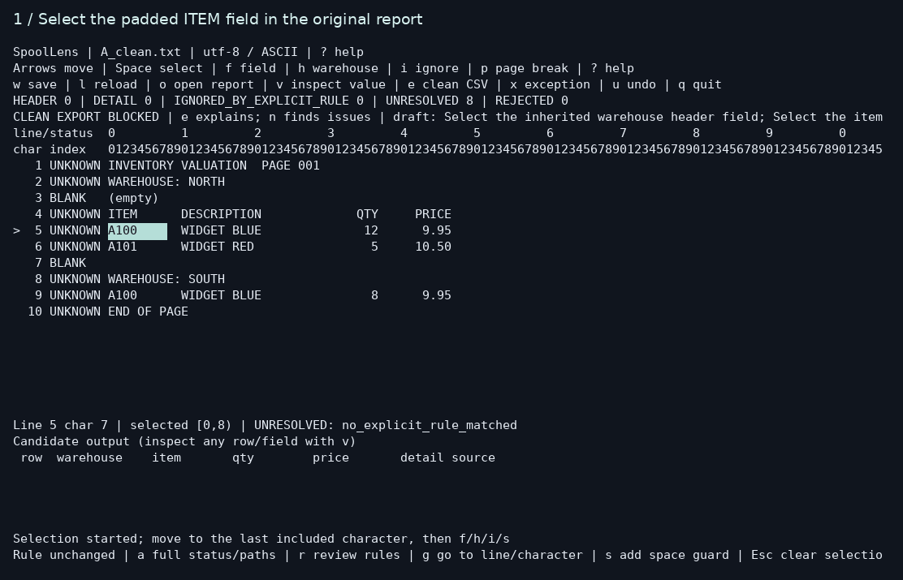

# A 25-second SpoolLens demo

This is a time-compressed sequence of actual SpoolLens terminal screens. It is not a promise that a first-time user finishes in 25 seconds. The only added text is the caption above each terminal screen; no terminal content or results were fabricated.

1. Select the padded item field in original report A
2. Select quantity and use the fixed field menu; define price the same way
3. Mark warehouse as inherited context
4. Explicitly classify headings/footers and preview the accepted rows
5. Inspect quantity's exact hash, physical line, character range, and source substring
6. Replay the saved rule on report C; shifted data is rejected and a notice remains unresolved
7. Attempt clean export: no CSV is created and the exact problematic lines are shown
8. Explicitly choose an exception ZIP, retaining candidate CSV, source bytes, rule, and full evidence
9. Close the process, reopen the saved JSON rule in a fresh process on valid report A, and replay
10. Export clean report A with adjacent audit, provenance, and manifest files

The malformed report C is never turned into a clean report. Its accepted rows are available only in the explicitly marked exception bundle. The final clean CSV comes from valid report A.

## Inspect the capture

The ten numbered PNGs are the original rendered terminal frames; matching `.txt` files expose the captured terminal text. `actual-session.ansi` contains the actual PTY output, and `capture-manifest.json` records frame timing, runtime hash, and artifact checks. It verifies that all source bytes remained unchanged and that exported A/C rows equal their original frozen expected CSVs.

These are the repository's original synthetic A/C fixtures, not the independent unseen-report test. Frame selection and rendering used pexpect, pyte, and Pillow as external capture tools. They are not SpoolLens runtime dependencies and are not vendored here. Terminal cells, including selection highlights, were rendered from captured bytes rather than reconstructed from anticipated results.

All displayed reports are original synthetic fixtures, covered by the repository's MIT license. The screen uses a standard DejaVu font; no font files are distributed.
